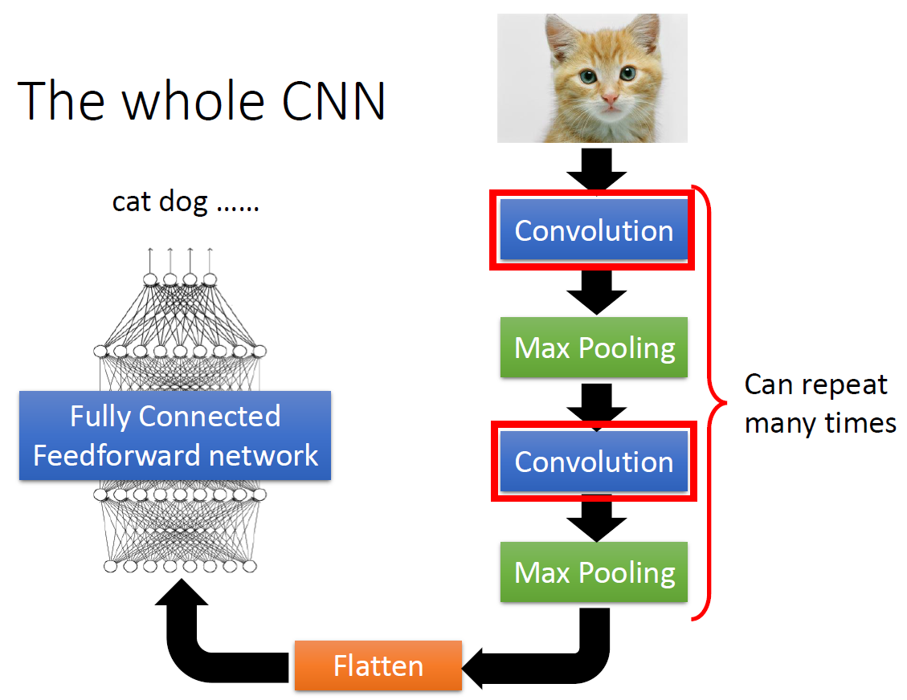

# 歡迎來到我的演算法學習網站
哈囉大家~ 這是我的學習網站，我學習的演算法是CNN
## 1. 演算法介紹
### CNN是個甚麼樣的演算法 ?
 CNN 是一種專門設計用於處理具有「網格狀結構」資料（例如影像）的深度學習模型。
 它模仿了人類大腦視覺皮層處理資訊的方式，能夠自動從圖片中學習並提取特徵，而不需要人工進行繁雜的特徵工程。
### CNN主要解決甚麼問題 ?
 在 CNN 出現之前，如果要讓電腦識別影像，必須手動定義邊緣、紋理等特徵，效果不佳。
#### CNN主要解決了以下問題 :
#### (1)平移不變性 : 無論物件出現在影像的哪個角落，CNN 都能識別出來。
#### (2)特徵自動提取：從低階的點、線，自動組合出高階的物件形狀（如眼睛、臉部）。
#### (3)減少運算複雜度： 它通過共享參數，大幅降低了模型的參數數量，讓電腦能更有效率地學習複雜圖像。
### 核心概念：CNN 運作流程
### CNN 的架構通常由以下幾個核心層堆疊而成：
 * 卷積層 (Convolutional Layer)：使用「卷積核」（Filter/Kernel）在影像上滑動，計算局部特徵。這就像是用放大鏡掃描影像，捕捉邊緣或特殊圖案。
 * 激勵函數層 (Activation Layer, 如 ReLU)：引入非線性，讓模型能學習更複雜的特徵組合。
 * 池化層 (Pooling Layer)：縮小影像尺寸，保留最顯著的特徵，減少運算量，同時防止過擬合（Overfitting）。
 * 全連接層 (Fully Connected Layer)：將提取到的特徵展平，用於最終的分類或回歸任務。

### CNN的常見應用 
* 影像分類： 相簿自動辨識人臉或物體
* 醫學影像分析：藉此輔助醫師判斷 X 光片或 MRI 中的腫瘤區域
* 臉部辨識及語音辨識
### 2.AI輔助學習紀錄

### 3. 查證與修正

### 4. 視覺化說明

### 5. 應用案例

### 6. 學習反思
